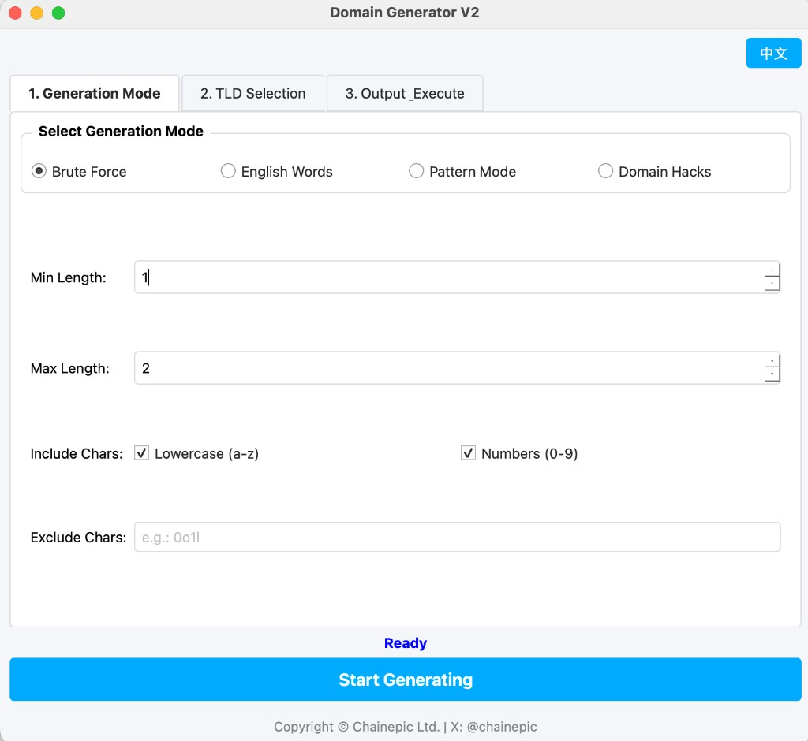
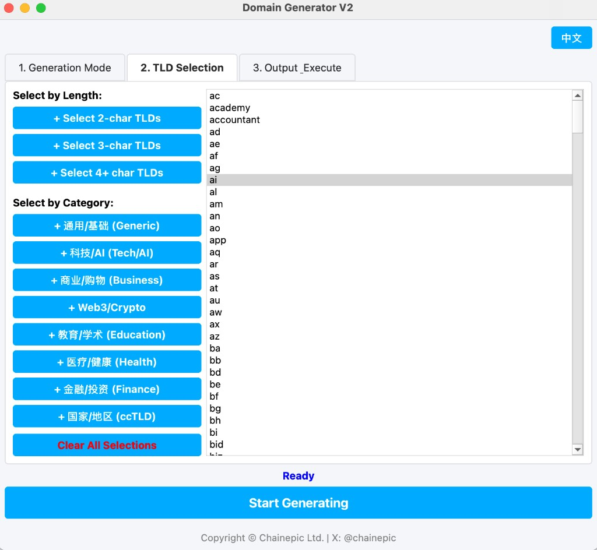
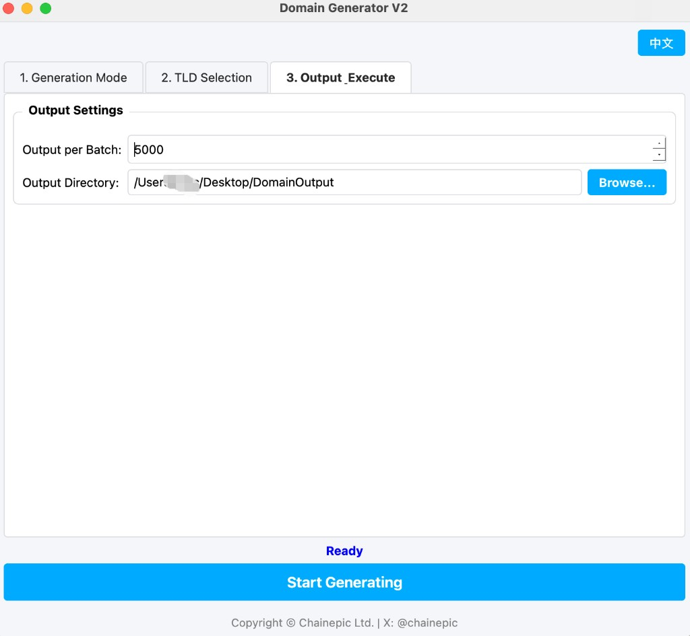

# DomainGenerator V2

[English](#english) | [中文](#chinese)

<a name="english"></a>
## English

**DomainGenerator V2** is a powerful, open-source domain name generation tool with a modern GUI. It helps you discover creative and available domain names using various generation modes.

### Screenshots
<p align="center">
  
  
  
</p>

### Features
- **Multiple Generation Modes**:
  - **Brute Force**: Generate domains by iterating through characters (e.g., a-z, 0-9).
  - **English Words**: Combine built-in English words or your custom words.
  - **Pattern Mode**: Use formulas like `CVC` (Consonant-Vowel-Consonant) to generate pronounceable domains.
  - **Domain Hacks**: Automatically match words with TLDs (e.g., `internet` + `.net` -> `inter.net`).
- **Extensive TLD Support**: Includes generic, tech, business, Web3/Crypto, education, health, finance, and ccTLDs.
- **Batch Selection**: Quickly select TLDs by length or category.
- **Bilingual UI**: Switch between English and Chinese dynamically.
- **High Performance**: Multi-threaded generation with batch output to handle millions of combinations.

### Installation

1. Clone the repository:
   ```bash
   git clone https://github.com/yourusername/DomainGenerator.git
   cd DomainGenerator
   ```
2. Install dependencies:
   ```bash
   pip install -r requirements.txt
   ```
3. Run the application:
   ```bash
   python domain_generator_gui.py
   ```

### Building Executables
You can build standalone executables for Windows and macOS using PyInstaller.
- **Windows**: Run `build_windows.bat`
- **macOS**: Run `pyinstaller DomainGenerator.spec`

### License
This project is licensed under the Apache License 2.0. See the [LICENSE](LICENSE) file for details.

### Contact
Copyright © Chainepic Ltd.
X (Twitter): [@chainepic](https://twitter.com/chainepic)

---

<a name="chinese"></a>
## 中文

**DomainGenerator V2** 是一款功能强大的开源域名生成工具，拥有现代化的图形界面。它可以帮助您通过多种生成模式发现有创意的域名。

### 软件截图
<p align="center">
  
  
  
</p>

### 功能特性
- **多种生成模式**：
  - **字符穷举**：通过遍历字符（如 a-z, 0-9）生成域名。
  - **英文单词**：组合内置的英文单词或您自定义的单词。
  - **Pattern 模式**：使用公式如 `CVC`（辅音-元音-辅音）生成易读的域名。
  - **创意拼词 (Domain Hacks)**：自动将单词与后缀匹配（例如 `internet` + `.net` -> `inter.net`）。
- **丰富的后缀支持**：包含通用、科技、商业、Web3/Crypto、教育、医疗、金融及各国国家代码后缀。
- **批量选择**：按长度或分类快速选中域名后缀。
- **双语界面**：支持中英双语动态切换。
- **高性能**：多线程生成，支持分批输出，轻松处理数百万种组合。

### 安装运行

1. 克隆仓库：
   ```bash
   git clone https://github.com/yourusername/DomainGenerator.git
   cd DomainGenerator
   ```
2. 安装依赖：
   ```bash
   pip install -r requirements.txt
   ```
3. 运行程序：
   ```bash
   python domain_generator_gui.py
   ```

### 打包可执行文件
您可以使用 PyInstaller 将程序打包为 Windows 和 macOS 的独立可执行文件。
- **Windows**：双击运行 `build_windows.bat`
- **macOS**：运行 `pyinstaller DomainGenerator.spec`

### 开源协议
本项目采用 Apache License 2.0 协议开源。详情请参阅 [LICENSE](LICENSE) 文件。

### 联系方式
Copyright © Chainepic Ltd.
X (Twitter): [@chainepic](https://twitter.com/chainepic)
